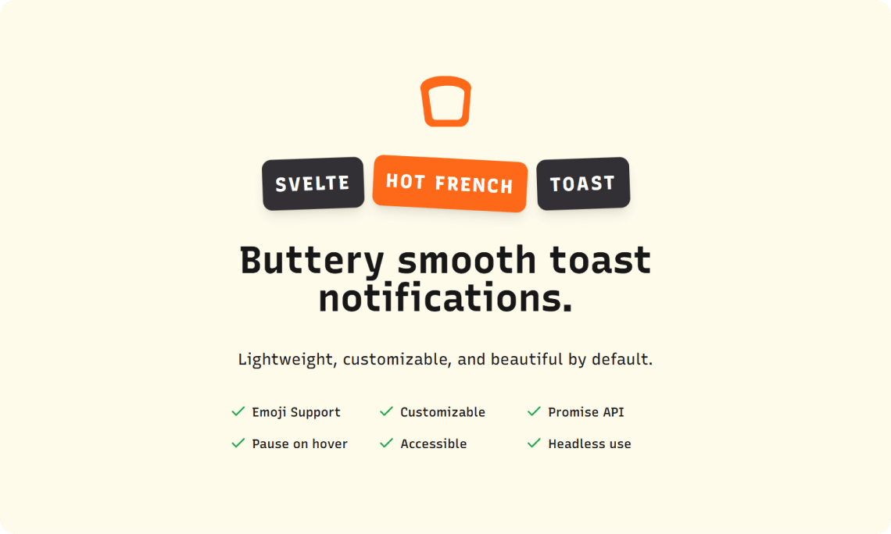

# Svelte Hot French Toast

Buttery smooth toast notifications for Svelte 5. Lightweight, customizable, and beautiful by default.

-   [Demo](https://svelte-hot-french-toast.vercel.app)
-   [CHANGELOG](https://github.com/babakfp/svelte-hot-french-toast/blob/main/CHANGELOG.md)
-   [NPM](https://www.npmjs.com/package/svelte-hot-french-toast)
-   [GitHub](https://github.com/babakfp/svelte-hot-french-toast)

> [!IMPORTANT]
> This is only compatible with Svelte 5. If you're using Svelte 4, please use a compatible version of [Svelte French Toast](https://github.com/kbrgl/svelte-french-toast).

## Installation

```bash
pnpm add -D svelte-hot-french-toast
```

## Usage

```svelte
<script lang="ts">
    import toast, { Toaster } from "svelte-hot-french-toast"

    const makeToast = () => {
        toast.success("Hello, World!")
    }
</script>

<Toaster />

<button onclick={makeToast}>Toast</button>
```

[More examples](https://svelte-hot-french-toast.vercel.app).

## About

I created this because the original project [Svelte French Toast](https://github.com/kbrgl/svelte-french-toast) wasn't compatible with Svelte 5 and my changes were possibly not going to be merged.

### Thanks

-   Thanks to [React Hot Toast](https://github.com/timolins/react-hot-toast) and its contributors.
-   Thanks to [Svelte French Toast](https://github.com/kbrgl/svelte-french-toast) and its contributors.
